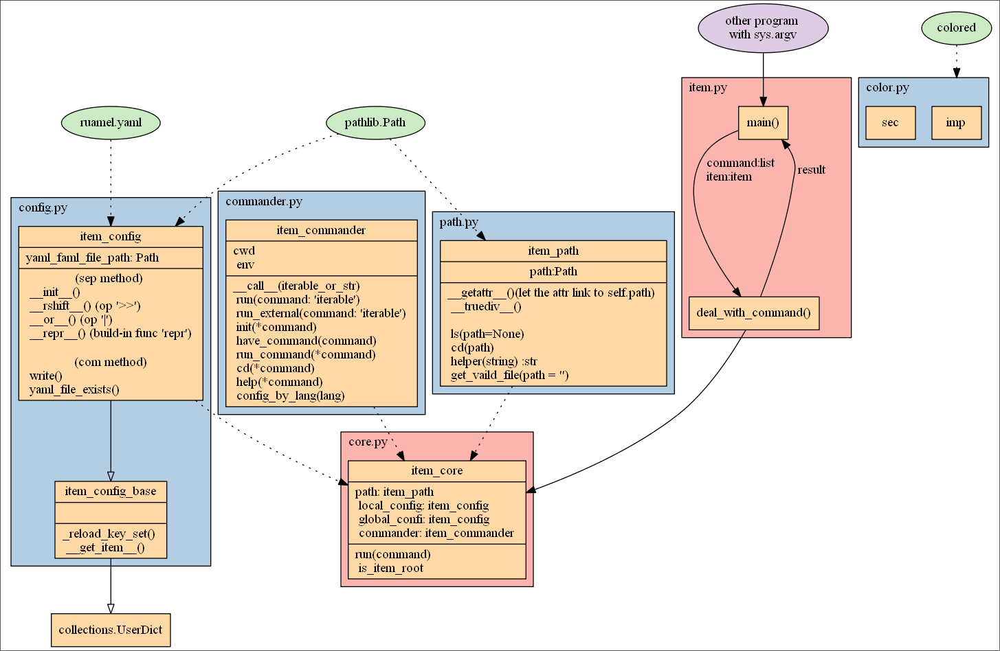

程序结构
===========================
从大的方面来看，程序结构包含了
``` yaml
- src:                    # 源文件目录
    - item:               # 包文件
      - __init__.py
      - color.py          # 提供着色方案
      - commander.py      # 提供了处理命令的接口
      - config.py         # 提供了处理配置文件的接口
      - core.py           # 提供item_core类，是最主要的部分，item通过调用它来运行
      - item.py           # 入口程序，处理输入输出，调用item类
      - path.py           # 为item提供更耦合的item_path类
      # 配置文件
      - global_config.yaml
    - item.py             # 调用item包里面的item.main()函数
- include:                # 不知道干什么，用来包含外部库的，
      ''                  # 但是python可以自己管理包，就显得很没有用
- doc:                    # 用来包含各国语言的帮助文档
    - ...
    - readme.md           # 索引
- build:                  # 用来存放构建信息
    - item_config.yaml    # 同上
- bin:                    # 用来存储构建好的二进制文件
    ''
- readme.md               # README
- LICENSE
- setup.py                # 通过这个来安装库
- .gitignore
```

而源文件保持以下的构造：

